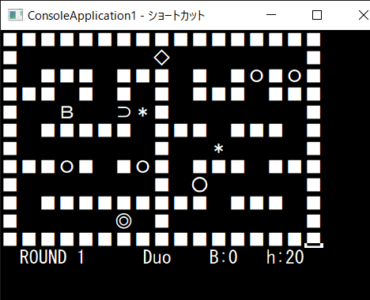

# MyRepository

1/6にいただいた課題（C++によるゲーム・行列クラス）についてのコードです。

# DEMO

# Features

【ゲーム】
Windowsコンソールアプリです。 
【行列クラス】
行列の積についてのクラスです。
積を定義できる２つの行列を２次元配列で指定します。

# Requirement

Windows10での動作確認済み。

# Usage

【ゲーム】 
十字キー・Tab・Space・0キー を使用します。 
操作方法は別途「How_to_play.txt」に記載しています。  
【行列クラス「multimat」（multimat.h ファイル）】 
２つの行列に対応する２次元配列 A[..][..], B[..][..] に対して、 
コンストラクタ「multimat<decltype(A), decltype(B)>(A, B)」により、A×B の情報をもつインスタンスをつくります。  
（publicメンバ関数は以下の通り。） 
(bool) get_within_std(): 積を定義できるとき true を返す。 
(int) get_rows(): 積の行数を返す。 
(int) get_columns(): 積の列数を返す。 
(Aの要素の型) get_entry(int i, int j): Aの要素の型として、積の(i, j)成分を返す。 
　※A×B が定義できない場合、1×1行列{0} をAの要素の型として返します。 
display_mat(): 積を、最大10行、10列まで表示する。 
display_typename(): 積の要素の型を表示する。

# Note

フォルダーごとに、コンパイルに必要なファイルを一式まとめています。
